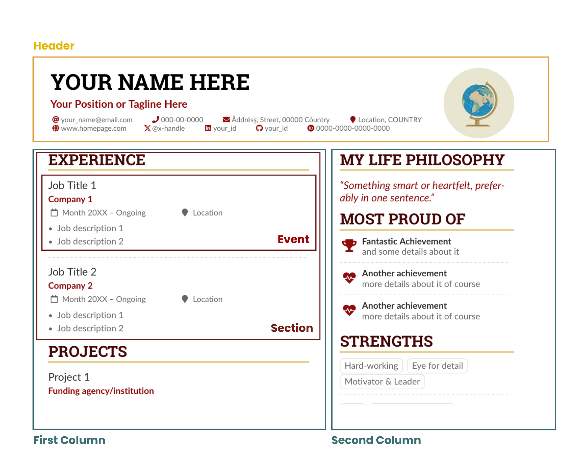

# DSL for AltaCV Resume

This project aims to provide a simple and flexible way to generate resumes in the [AltaCV](https://github.com/liantze/AltaCV) LaTeX format using a typesafe Kotlin DSL.

## AltaCV Resume Structure



## Usage example
Sample files used in this example are located in the [samples](docs/samples) directory.

1. Generate a resume in Kotlin project:

    Create a Kotlin file (e.g., `Main.kt`) and use the provided DSL to define your resume:

    ```kotlin
    import com.melkassib.altacv.generator.dsl.domain.section.event.EventPeriodDate.Companion.eventDurationDate
    import com.melkassib.altacv.generator.dsl.domain.section.event.EventPeriodString.Companion.eventDurationStr
    import com.melkassib.altacv.generator.dsl.domain.builders.altacv
    import com.melkassib.altacv.generator.dsl.domain.userInfo.*
    import com.melkassib.altacv.generator.dsl.domain.section.*
    import com.melkassib.altacv.generator.dsl.domain.*
    import com.melkassib.altacv.generator.dsl.utils.*

    fun main() {
        val resume =
            altacv {
                config {
                    photoShape = PhotoShape.NORMAL
                    theme = PredefinedColorPalette.THEME3
                }

                header {
                    tagline = " Your Position or Tagline Here"
                    photo = Photo(2.8, "Globe_High.png")
                    userInfo = UserInfo("Your Name Here", setOf(
                        EmailField("your_name@email.com"),
                        PhoneField("000-00-0000"),
                        MailAddressField("Address, Street, 00000 Country"),
                        LocationField("Location, COUNTRY"),
                        HomePageField("www.homepage.com"),
                        TwitterField("@twitterhandle"),
                        LinkedinField("your_id"),
                        GithubField("your_id"),
                        OrcidField("0000-0000-0000-0000"),
                        UserInfoField("gitlab", "\\faGitlab", "https://gitlab.com/", "your_id")
                    ))
                }

                sections {
                    section("Experience", firstColumn(1), Divider) {
                        contents {
                            event("Job Title 1") {
                                holder = "Company 1"
                                location = "Location"
                                duration = eventDurationStr("Month XXXX", "Ongoing")
                                description = listOf(
                                    Item("Job description 1"),
                                    Item("Job description 2"),
                                    Item("Job description 3", false)
                                )
                            }

                            event("Job Title 2") {
                                holder = "Company 2"
                                location = "Location"
                                duration = eventDurationDate("2023-10", "2023-10")
                                description = listOf(Item("Item1"))
                            }

                            event("Job Title 3") {
                                holder = "Company 3"
                                location = "Location"
                            }
                        }
                    }

                    section("Most Proud of", firstColumn(2), ignored = false) {
                        contents {
                            achievement("faTrophy", "Fantastic Achievement", "and some details about it")
                            achievement("faHeartbeat", "Another achievement", "more details about it of course")
                            achievement("faHeartbeat", "Another achievement", "more details about it of course")
                        }
                    }

                    section("My Life Philosophy", firstColumn(1)) {
                        contents {
                            quote("Something smart or heartfelt, preferably in one sentence.")
                        }
                    }

                    section("Strengths", firstColumn(3)) {
                        contents {
                            tag("Hard-working")
                            tag("Eye for detail")
                            content(NewLine)

                            tag("Motivator & Leader")
                            content(Divider)

                            tag("C++")
                            tag("Embedded Systems")
                            content(NewLine)

                            tag("Statistical Analysis")
                        }
                    }

                    section("Languages", firstColumn(4)) {
                        contents {
                            skill("Arabic", "Native/Bilingual")
                            skill("English", "Professional working proficiency")
                            skill("Spanish", "Limited working proficiency")
                            skill("German", 2.0)
                        }
                    }

                    section("Projects", firstColumn(2), separator = Divider) {
                        contents {
                            event("Project 1") {
                                holder = "Funding agency/institution"
                                description = listOf(Item("Details"))
                            }

                            event("Project 1") {
                                holder = "Funding agency/institution"
                                duration = eventDurationStr("Project duration")
                                description = listOf(Item(" A short abstract would also work.", withBullet = false))
                            }
                        }
                    }

                    section("A day of my life", firstColumn(3)) {
                        contents {
                            wheelchart(1.5, 0.5) {
                                item(6, 8, "accent!30", "Sleep,\\\\beautiful sleep")
                                item(3, 8, "accent!40", "Hopeful novelist by night")
                                item(8, 8, "accent!60", "Daytime job")
                                item(2, 10, "accent", "Sports and relaxation")
                                item(5, 8, "accent!20", "Spending time with family")
                            }
                            content("\\newpage")
                        }
                    }

                    section("Education", firstColumn(4), separator = Divider) {
                        contents {
                            event("Ph.D. in Your Discipline") {
                                holder = "Your University"
                                duration =  eventDurationDate("2002-09", "2006-06")
                                description = listOf(Item("Thesis title: Wonderful Research",  false))
                            }

                            event("M.Sc. in Your Discipline") {
                                holder = "Your University"
                                duration = eventDurationDate("2001-09", "2002-06")
                            }

                            event("B.Sc. in Your Discipline") {
                                holder = "Stanford University"
                                duration = eventDurationDate("1998-09", "2001-06")
                            }
                        }
                    }
                }
            }

        println(resume.toLaTeX())   // Generate LaTeX output
        println(resume.toJson())    // Generate JSON representation of the resume
    }
    ```

2. Generate resume from JSON (e.g. [sample-resume.json](docs/samples/sample-resume.json)) in Java project:
    ```java
    import static com.melkassib.altacv.generator.dsl.serialization.JsonSerializers.buildResumeFromJson;
    import static com.melkassib.altacv.generator.dsl.utils.ResumeTemplate.toLaTeX;

    public class Main {
        public static void main(String[] args) {
            final String resumeAsJson = "...";

            final Resume resume = buildResumeFromJson(resumeAsJson);
            final String resumeLatexContent = toLaTeX(resume);

            System.out.println(resumeLatexContent); // Generate LaTeX output
        }
    }
    ```
3. The easiest way to generate your resume PDF:
   1. Copy the generated LaTeX content to the online LaTeX editor [Overleaf](https://www.overleaf.com/).
   2. Add the AltaCV package class [altacv.cls](https://github.com/liantze/AltaCV/blob/main/altacv.cls) to the same directory as your LaTeX file.
   3. Compile the LaTeX file to generate the PDF (using XeLaTeX compiler, Tex Live version 2024).
